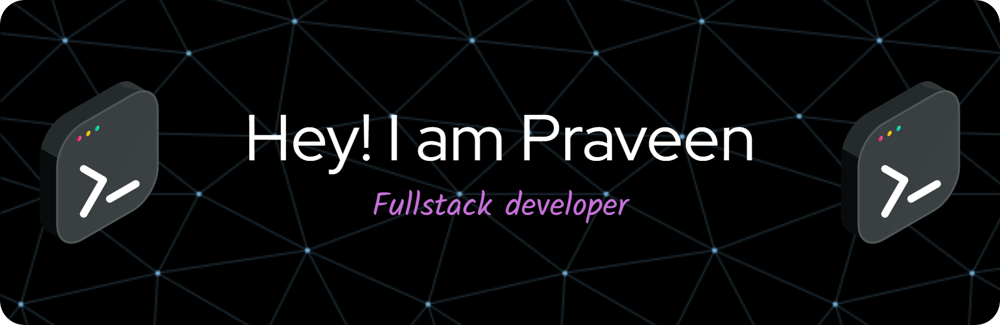

 

- 🌱 I’m currently learning everything 🤣

- 👨‍💻 All of my projects are available at **[Here](https://github.com/Praveenskg?tab=repositories)**

- 💬 Ask me about **React, JavaScript**

- 📫 Reach me At **[Here](mailto:Praveencdg@gmail.com)**

### Connect with me:

  
  
  

### Languages and Tools:

 

 
 

  
  

